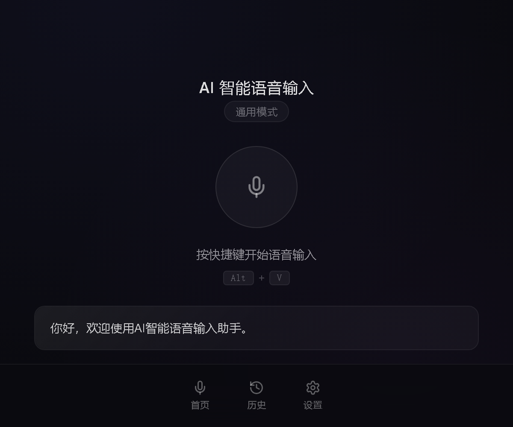
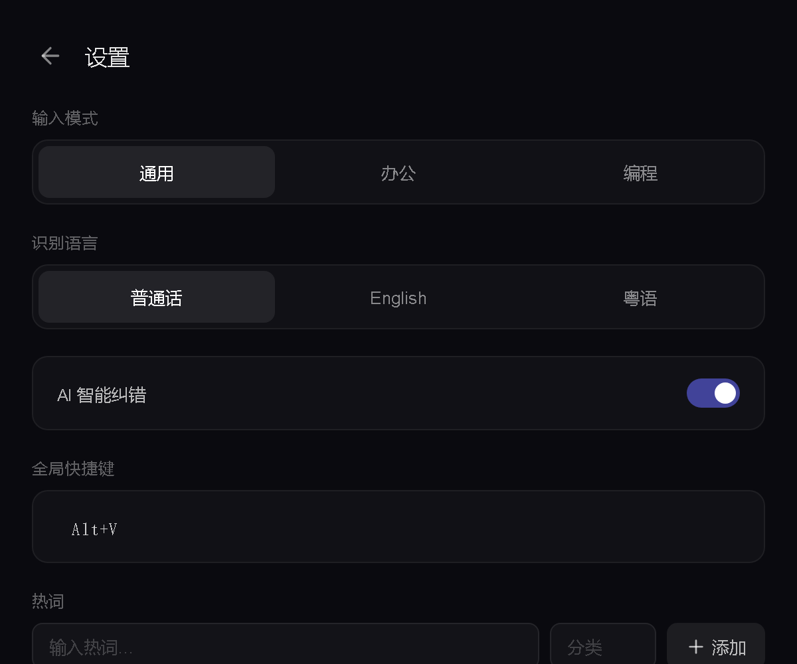
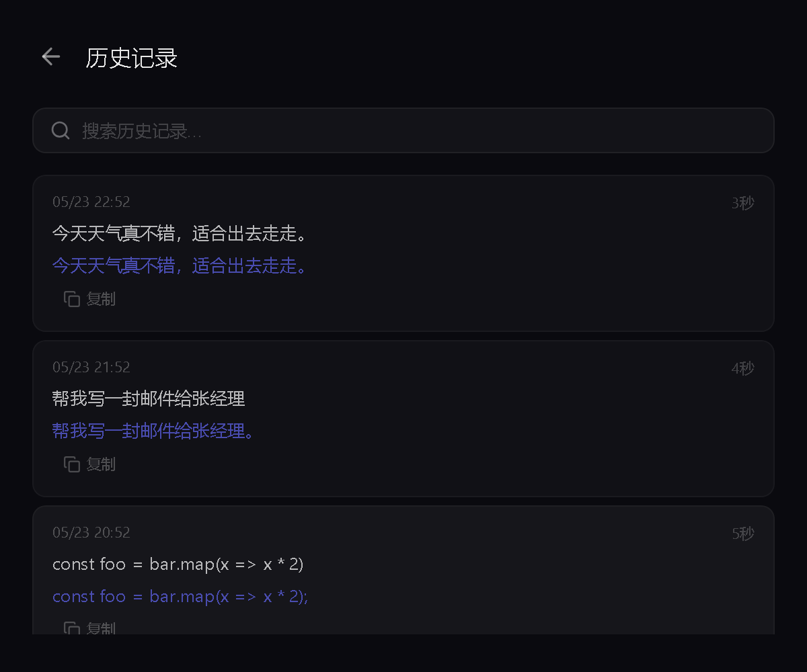

<p align="center">
  
</p>

<h1 align="center">AI 智能语音输入助手</h1>

<p align="center">
  <strong>语音转文字 · AI 纠错 · 跨应用输入 · 多模式支持</strong>
</p>

<p align="center">
  
  
  
  
  
  
</p>

---

## 目录

- [项目简介](#项目简介)
- [功能特性](#功能特性)
- [技术架构](#技术架构)
- [安装指南](#安装指南)
- [快速上手](#快速上手)
- [功能介绍](#功能介绍)
- [开发指南](#开发指南)
- [常见问题](#常见问题)
- [许可证](#许可证)

---

## 项目简介

AI 智能语音输入助手是一款 PC 端的语音输入工具，基于 **FunASR** 高精度语音识别引擎和 **Ollama** AI 纠错模型，实现「说话即输入」的流畅体验。支持通用、办公、编程三种输入模式，可跨应用粘贴到任意窗口。

> 告别键盘，用语音高效输入。

---

## 功能特性

### 🎤 高精度语音识别
- 基于 FunASR paraformer-large 模型，识别准确率极高
- 支持普通话、English、粤语三种语言
- 智能 VAD（语音活动检测）自动检测说话结束

### 🤖 AI 智能纠错
- 集成 Ollama（qwen2.5:7b）对识别结果进行智能纠错
- 自动修正标点符号、大小写和专业术语
- 可手动开启/关闭，满足不同场景需求

### ⚡ 流式输入（实验性）
- 关闭 AI 纠错时，识别结果实时流式输入到当前焦点窗口
- 低延迟，所见即所得

### 📋 跨应用自动输入
- 通过剪贴板 + 模拟按键实现任意应用的文本输入
- 支持浏览器、编辑器、办公软件等所有 Windows 应用

### 🔧 三种输入模式
| 模式 | 适用场景 | 特点 |
|------|---------|------|
| 通用模式 | 日常聊天、笔记 | 通用热词，自然语言纠错 |
| 办公模式 | 邮件、文档、报表 | 办公术语优化 |
| 编程模式 | IDE、终端 | 保留代码格式，英文符号纠错 |

### 📝 热词管理
- 自定义热词，大幅提升专业术语识别准确率
- 支持分类管理，按权重排序
- 热词自动同步到语音识别引擎

### 📜 历史记录
- 自动保存每次语音输入记录
- 支持关键词搜索
- 显示识别时长、语种、模式等信息

### ⌨️ 全局快捷键
- 默认 `Alt + V` 一键开始/停止录音
- 支持自定义快捷键组合

---

## 技术架构

```
┌─────────────────────────────────────────────────┐
│                  Electron 33                     │
│  ┌─────────────┐  ┌──────────────────────────┐  │
│  │  React 18    │  │    Electron Main Process │  │
│  │  (Vite 6)    │  │    - 快捷键管理          │  │
│  │  - 设置页    │  │    - IPC 通信            │  │
│  │  - 历史记录  │  │    - Ollama 纠错         │  │
│  │  - 主界面    │  │    - 自动输入            │  │
│  └──────┬───────┘  └──────────┬───────────────┘  │
│         │                     │                   │
│         └─────────┬───────────┘                   │
│                   │                               │
│         ┌─────────▼───────────┐                   │
│         │   WebSocket (9877)  │                   │
│         └─────────┬───────────┘                   │
└───────────────────┼───────────────────────────────┘
                    │
┌───────────────────▼───────────────────────────────┐
│              Python 3.11 Server                    │
│  ┌─────────────┐  ┌──────────────────────────┐   │
│  │   FunASR    │  │    VAD 语音活动检测       │   │
│  │  paraformer │  │    (自动检测说话结束)     │   │
│  └─────────────┘  └──────────────────────────┘   │
└───────────────────────────────────────────────────┘
                    │
┌───────────────────▼───────────────────────────────┐
│              External Services                    │
│  ┌─────────────┐  ┌──────────────────────────┐   │
│  │   Ollama    │  │    MySQL 8 数据库         │   │
│  │  qwen2.5:7b │  │    (配置/历史/热词)      │   │
│  └─────────────┘  └──────────────────────────┘   │
└───────────────────────────────────────────────────┘
```

### 技术栈

| 层级 | 技术 | 用途 |
|------|------|------|
| 前端 | React 18 + TypeScript | UI 界面 |
| 构建 | Vite 6 + vite-plugin-electron | 构建打包 |
| 桌面 | Electron 33 | 桌面应用框架 |
| 识别 | FunASR paraformer-large | 语音识别 |
| 纠错 | Ollama qwen2.5:7b | AI 文本纠错 |
| 通信 | WebSocket (端口 9877) | Electron ↔ Python |
| 数据库 | MySQL 8 (远程) | 配置/历史/热词 |
| 自动输入 | PowerShell .NET Clipboard | 跨应用文本输入 |

---

## 安装指南

### 系统要求

- **操作系统**: Windows 10/11 64位
- **GPU**: 推荐 NVIDIA 显卡（CUDA 加速），也可纯 CPU 运行
- **内存**: 建议 8GB+
- **硬盘**: 建议 10GB+ 可用空间
- **依赖**:
  - [Ollama](https://ollama.ai/)（用于 AI 纠错）
  - Python 3.11（语音识别引擎）

### 安装步骤

#### 1️⃣ 下载安装包

从 [Releases](https://github.com/beiyijie/Voice-input-method/releases) 页面下载最新版本的 `语音输入助手 Setup x.x.x.exe`。

#### 2️⃣ 安装应用

双击安装包，按照提示完成安装。安装程序会自动创建桌面快捷方式和开始菜单项。

#### 3️⃣ 安装 Ollama（可选，用于 AI 纠错）

```bash
# 下载 Ollama https://ollama.ai/
# 拉取纠错模型
ollama pull qwen2.5:7b
```

> 不安装 Ollama 也可正常使用语音输入功能，仅 AI 纠错不可用。

#### 4️⃣ 启动应用

安装完成后，桌面双击「语音输入助手」图标启动。应用启动后会在系统托盘运行，通过 `Alt + V` 快捷键控制录音。

---

## 快速上手

### 基本使用流程

1. **打开任意输入框**（浏览器、记事本、IDE 等）
2. **按下 `Alt + V`**（或自定义快捷键），开始录音
3. **说出你要输入的内容**
4. **再次按下 `Alt + V`**（或等待语音自动结束），停止录音
5. **识别结果自动粘贴**到当前输入框

### 录制状态

| 状态 | 图标 | 说明 |
|------|------|------|
| 待机 | 🎤 | 等待开始录音 |
| 录音中 | ⬜ | 正在录音，说话中 |
| 处理中 | 动画 | 正在识别和纠错 |

### 界面导航

| | |
|:--:|:--:|
|  |  |
| *主界面 - 录音控制和结果显示* | *设置页 - 模式、语言、热词管理* |

| | |
|:--:|:--:|
|  | |
| *历史记录 - 查看和搜索历史输入* | |

---

## 功能介绍

### 🎯 输入模式

应用提供三种输入模式，针对不同场景优化识别和纠错策略：

**通用模式** — 适合日常聊天、笔记记录、网页搜索等场景。使用通用热词库，AI 纠错偏向自然语言处理。

**办公模式** — 适合写邮件、文档、报表、PPT 等办公场景。纠错时优化标点和格式，对办公常用词汇有更好识别率。

**编程模式** — 适合 IDE、终端等编程场景。保留代码格式，正确处理英文符号，对编程术语有专门优化。

> 在设置页顶部即可切换输入模式，实时生效。

### 🤖 AI 智能纠错

开启后，语音识别结果会自动发送到本地 Ollama 服务进行纠错处理：

- 修正标点符号（添加句号、逗号等）
- 修正大小写（英语句子首字母大写）
- 修正专业术语（根据热词库）
- 保持原意不变

> 关闭 AI 纠错后，识别结果将以流式方式实时输入到当前窗口，延迟更低。

### 📝 热词管理

热词是提高语音识别准确率的关键功能。添加专业术语作为热词，识别引擎会优先识别这些词汇：

- **添加热词**: 在设置页输入热词和分类，点击「添加」
- **分类管理**: 为热词添加分类标签（如「AI」「编程」「医疗」）
- **权重排序**: 高权重热词优先级更高（默认 50，范围 0-100）

**建议添加的热词示例：**

| 热词 | 分类 | 说明 |
|------|------|------|
| 神经网络 | AI | 技术术语 |
| 异步编程 | 编程 | 编程概念 |
| 卷积层 | AI | 深度学习术语 |
| 行政复议 | 法律 | 专业领域词 |

### ⌨️ 快捷键自定义

在设置页点击快捷键区域，按下新的组合键即可修改。支持：

- `Ctrl` / `Alt` / `Shift` + 任意键
- 必须包含至少一个修饰键（Ctrl/Alt/Cmd）

---

## 开发指南

### 环境搭建

```bash
# 克隆仓库
git clone https://github.com/beiyijie/Voice-input-method.git
cd Voice-input-method

# 安装前端依赖
npm install

# 安装 Python 依赖
pip install -r python/requirements.txt
```

### 项目结构

```
voice-input-method/
├── electron/              # Electron 主进程
│   ├── main.ts           # 主进程入口（窗口、快捷键、IPC）
│   ├── preload.ts        # 预加载脚本（暴露 API 到渲染进程）
│   ├── database.ts       # MySQL 数据库操作
│   ├── auto-type.ts      # 跨应用自动输入（剪贴板 + 模拟按键）
│   ├── ollama.ts         # Ollama AI 纠错
│   ├── python-bridge.ts  # Python WebSocket 通信
│   ├── modes.ts          # 输入模式配置
│   ├── commands.ts       # 语音命令解析
│   └── subtitle-window.ts # 字幕窗口
├── src/                   # React 前端
│   ├── App.tsx           # 主应用组件
│   ├── App.css           # 全局样式（玻璃拟态设计）
│   ├── pages/
│   │   ├── Settings.tsx  # 设置页面
│   │   ├── History.tsx   # 历史记录页面
│   │   └── Subtitle.tsx  # 字幕窗口
│   └── main.tsx          # React 入口
├── python/                # Python 语音识别服务
│   ├── server.py         # WebSocket 服务器
│   ├── recognizer.py     # FunASR 识别封装
│   └── vad.py            # 语音活动检测
├── resources/             # 应用资源（图标）
├── docs/images/           # 文档图片
└── electron-builder.yml   # 打包配置
```

### 开发模式

```bash
# 启动前端开发服务器（仅 UI）
npm run dev

# 启动完整 Electron 开发模式
npm run electron:dev

# 启动 Python 语音识别服务
python python/server.py
```

### 构建打包

```bash
# 构建生产版本
npm run build

# 打包为 Windows 安装程序
npm run electron:build
```

> 打包时请确保网络通畅，需要从镜像下载 Electron 和 NSIS 工具。

### 技术要点

- **语音识别流程**: 录音 → WebSocket → FunASR 识别 → 返回文本 → Ollama 纠错 → 粘贴到目标窗口
- **跨应用输入**: 使用 PowerShell `System.Windows.Forms.Clipboard` + `SendKeys` 实现
- **并发控制**: 基于 generation 机制的旧结果丢弃策略，防止快速多次录音时结果错乱
- **配置存储**: 所有配置（模式、语言、快捷键等）持久化到 MySQL 数据库

---

## 常见问题

### Q: 录音没有反应？

1. 检查麦克风权限和驱动程序是否正常
2. 确认 Python 服务是否启动（`python/python/server.py`）
3. 查看应用日志是否有错误信息

### Q: 识别结果不准确？

1. 在设置中添加相关热词
2. 切换到合适的输入模式（通用/办公/编程）
3. 确保麦克风质量良好，环境噪音较小
4. 开启 AI 纠错功能

### Q: AI 纠错不工作？

1. 确认 Ollama 已安装并运行（`ollama serve`）
2. 确认已拉取模型（`ollama pull qwen2.5:7b`）
3. 检查 Ollama 服务地址是否正确（默认 `http://127.0.0.1:11434`）

### Q: 快捷键无法使用？

1. 检查快捷键是否与其他应用冲突
2. 在设置页面重新设置快捷键
3. 重启应用后生效

### Q: 无法粘贴到目标应用？

某些应用（如安全敏感的密码输入框）禁止程序化粘贴。请尝试在其他普通输入框中测试。

### Q: 打包构建失败？

1. 确保网络畅通，electron-builder 需要下载依赖工具
2. 如在国内，设置镜像环境变量：
   ```bash
   export ELECTRON_MIRROR="https://npmmirror.com/mirrors/electron/"
   export ELECTRON_BUILDER_BINARIES_MIRROR="https://npmmirror.com/mirrors/electron-builder-binaries/"
   ```
3. 确保已安装 Visual Studio Build Tools（如需编译原生模块）

---

## 许可证

本项目基于 MIT 许可证开源。

---

<p align="center">
  <sub>Built with ❤️ by Claude Code & beiyijie</sub>
</p>
